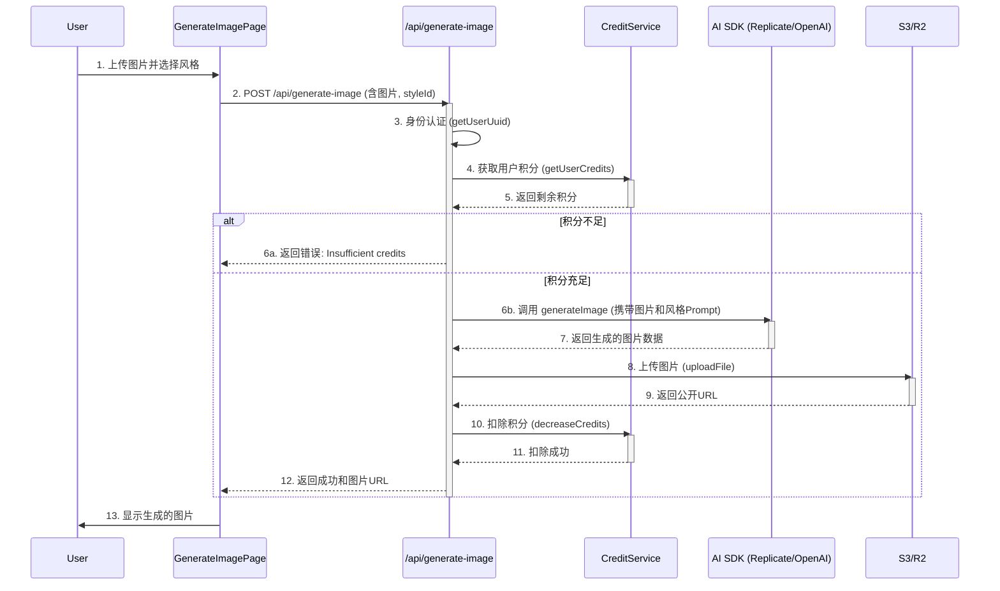

# Product Requirements Document: AI Portrait Studio (V1 MVP)

## 1. 产品路线图 (Product Roadmap)

**核心目标 (Mission)**
> 毫不费力地将个人肖像转化为令人惊叹的、影棚级质感的AI艺术作品。

**用户画像 (Persona)**
*   **画像**: 追求个性化表达的年轻社交媒体用户、希望拥有独特头像的游戏玩家、以及希望不费吹灰之力就能创作出自己艺术形象的普通人。
*   **核心痛点**: 缺乏专业的绘画或修图技能，无法创作出满意的个性化头像和艺术照片；使用专业的AI工具（如Midjourney）门槛高、流程复杂。

**V1: 最小可行产品 (MVP) - “即时风格魔法”**
*   **用户认证系统 (复用)**: 用户可以登录和注册。
*   **积分系统 (复用)**: 用户的操作消耗积分，积分为零需充值。
*   **核心生成流程**:
    1.  **单张肖像上传**: 用户上传一张清晰的面部照片。
    2.  **精选风格选择**: 提供一个精心挑选的、数量有限（例如6-8种）但效果惊艳的预设风格列表供用户选择。
    3.  **一键生成**: 用户选择风格后，点击按钮开始生成。
    4.  **结果展示与下载**: 在当前页面直接展示生成后的高清图片，并提供下载按钮。
*   **风格效果展示页 (作品集)**: 一个简单的画廊页面，展示所有V1支持的风格及其效果图，吸引用户尝试。

**V2 及以后版本 (Future Releases) - “AI数字分身工作室”**
*   **AI数字分身工作室 (核心功能)**: 引导用户上传多张照片，训练专属模型，无需重复上传即可生成任意风格的“自己”。
*   **纯文本生成肖像**: 增加文生图功能，通过文字描述创造虚拟人物肖像。
*   **高级编辑工具**: 允许微调Prompt或使用局部重绘功能。
*   **个人作品库**: 为用户提供保存和管理历史作品的空间。
*   **社区风格广场**: 允许用户创建并分享自己的风格模型。

**关键业务逻辑 (Business Rules) - MVP版本**
1.  用户必须登录才能使用图片生成功能。
2.  每次成功生成图片会消耗固定数量的积分（暂定：10积分/次）。
3.  生成前检查积分，不足则引导充值。
4.  图片成功返回后才扣除积分。
5.  V1版本只支持单图上传和固定的风格选择。

**数据契约 (Data Contract) - MVP版本**
*   **输入**: `user_uuid`, `uploaded_image_file`, `selected_style_id`
*   **输出**: `generated_image_url`, `remaining_credits`

---

## 2. MVP 原型设计 (选定)

**设计理念**: **概念原型 3: "沉浸式画布" (Image-Centric Canvas)**

采用极简主义，以用户上传的图片为视觉中心。UI控件以轻量、现代的方式浮现，让用户的注意力始终聚焦在图片本身，提供流畅且富有沉浸感的创作体验。此设计高度借鉴了成功的移动端视觉应用，用户学习成本低，且在移动设备上表现出色。

```
+--------------------------------------------------------------------------+
|  ShipAny AI Studio                                      [Credits: 90]    |
|--------------------------------------------------------------------------|
|                                                                          |
|                                                                          |
|      +--------------------------------------------------------------+      |
|      |                                                              |      |
|      |                                                              |      |
|      |            YOUR PORTRAIT IS THE CANVAS                       |      |
|      |       (After upload, the user's photo is shown here)         |      |
|      |                                                              |      |
|      |                                                              |      |
|      +--------------------------------------------------------------+      |
|                                                                          |
|                       <-- Choose Your Style -->                        |
|                                                                          |
|   [Img:Cyber]   [Img:Anime]   [Img:3D]   [Img:Paint]   [Img:Hero]      |
|   Cyberpunk     Retro Anime   3D Toon    Oil Paint     Hero Style      |
|                    (*)                                                 |
|                                                                          |
|                           [ ✨ Generate ]                               |
|                                                                          |
|     (The result will replace the canvas above, with Download button)     |
|                                                                          |
+--------------------------------------------------------------------------+
```

---

## 3. 架构设计蓝图 (Architecture Design Blueprint)

### 核心流程图 (Core Flow Diagram)



### 组件交互说明

#### 新增文件/模块

1.  **`app/[locale]/(default)/generate-image/page.tsx`**:
    *   **职责**: 核心前端UI页面，使用`"use client"`。
    *   **交互**:
        *   调用 `useAppContext` 获取用户登录状态和积分信息。
        *   向后端 `/api/generate-image` 发起 `fetch` POST 请求。
        *   使用 `sonner` 组件显示成功或错误通知。
        *   复用 `@/components/ui/` 中的 `Button`, `Textarea`, `Card` 等组件构建界面。

2.  **`app/api/generate-image/route.ts`**:
    *   **职责**: 核心后端API，处理所有业务逻辑。
    *   **交互**:
        *   调用 `services/user.ts` 的 `getUserUuid()` 进行用户身份验证。
        *   调用 `services/credit.ts` 的 `getUserCredits()` 和 `decreaseCredits()` 进行积分检查与扣费。
        *   调用 `ai` SDK 的 `generateImage` 方法，并传入从 `aisdk/` 目录中实例化的模型（如 `replicate.image(...)`）。
        *   调用 `lib/storage.ts` 的 `newStorage().uploadFile()` 方法将图片存入对象存储。
        *   调用 `lib/resp.ts` 中的 `respData` 和 `respErr` 格式化返回结果。

#### 修改的现有文件/模块

1.  **`services/credit.ts`**:
    *   **修改点**: 在 `CreditsTransType` 枚举中添加 `'ImageGen'` 类型，并定义 `IMAGE_GENERATION_COST` 常量。
    *   **目的**: 允许记账系统识别出图片生成服务的积分消耗。

2.  **`i18n/pages/landing/en.json` 和 `zh.json`**:
    *   **修改点**: 在 `header.nav.items` 数组中添加新的导航项，指向 `/generate-image`。
    *   **目的**: 在网站导航栏为新功能提供入口。

### 技术选型与风险

*   **关键技术选型**:
    *   **AI模型**: MVP阶段推荐使用支持**图生图（Image-to-Image）**并能通过**IP-Adapter**或类似技术进行风格迁移的模型。Replicate平台上的`black-forest-labs/flux-schnell` 或类似模型是很好的起点，因为它们已经集成在项目中。
    *   **前端状态管理**: 继续使用项目现有的 `React Context` (`AppContext`) 进行简单的全局状态管理，无需引入更重的状态管理库。
    *   **文件存储**: 复用项目已封装好的 `lib/storage.ts`，它基于 AWS S3 SDK，可无缝对接 AWS S3, Cloudflare R2, MinIO 等对象存储服务。
    *   **后端运行时**: 推荐使用 Next.js 默认的 Serverless/Edge Runtime，性能足够且成本效益高。

*   **潜在技术风险**:
    *   **AI生成耗时过长**: 某些复杂的图片生成可能超过 Serverless 函数的默认执行时间（通常为10-60秒）。
        *   **缓解措施 (V1)**: 优先选择响应速度快的模型。在前端设置合理的超时预期和清晰的加载提示。使用Vercel Pro计划可将函数超时延长至5分钟。
        *   **解决方案 (V2)**: 对于"数字分身"训练等长时间任务，必须引入异步任务队列（如 Vercel KV Queue, Upstash QStash, BullMQ）。
    *   **风格迁移效果不稳定**: 用户上传的肖像质量、角度、光照各不相同，可能导致风格化效果不佳。
        *   **缓解措施**: 在上传界面提供清晰的引导（例如："请上传光线充足、面部清晰的正脸照片"）。精心挑选和测试V1版本的预设风格，确保它们对大多数常见肖像都有良好效果。
    *   **成本控制**: GPU资源消耗昂贵。固定积分消耗的模式可能在面对不同成本的模型时出现亏损。
        *   **缓解措施**: MVP阶段使用成本相对可控的模型，并设定有利润空间的积分价格。未来可根据调用的模型或生成参数（如分辨率）进行动态计费。

---

## 4. 技术决策详细方案 (Technical Implementation Plan)

### 4.1 AI 模型选型 - 豆包火山 Ark (最终决策)

**选定方案**: 豆包 Seedream 4.0 (doubao-seedream-4-0-250828)

**核心优势**:
- ✅ 原生支持**图生图** (Image-to-Image)
- ✅ 支持**风格参考图**模式 (用户图 + 风格参考图 → 风格化输出)
- ✅ 直接返回 URL (`response_format="url"`)，无需手动上传到 S3
- ✅ 支持 2K 高分辨率输出
- ✅ 中国大陆访问友好

**官方 API 示例** (Python SDK):
```python
from volcenginesdkarkruntime import Ark

client = Ark(
    base_url="https://ark.cn-beijing.volces.com/api/v3",
    api_key=os.environ.get("ARK_API_KEY"),
)

response = client.images.generate(
    model="doubao-seedream-4-0-250828",
    prompt="风格描述文本",
    image=["用户上传图片base64", "风格参考图URL"],
    size="2K",
    response_format="url",
    watermark=False
)
```

**Node.js/TypeScript 适配方案**:

**方案 A: 直接 HTTP API 调用** (✅ 推荐用于 MVP)
```typescript
// lib/doubao.ts
export async function generateImageWithDoubao({
  userImageBase64,
  styleReferenceUrl,
  stylePrompt,
}: {
  userImageBase64: string;
  styleReferenceUrl: string;
  stylePrompt: string;
}) {
  const response = await fetch(
    "https://ark.cn-beijing.volces.com/api/v3/images/generations",
    {
      method: "POST",
      headers: {
        "Authorization": `Bearer ${process.env.ARK_API_KEY}`,
        "Content-Type": "application/json"
      },
      body: JSON.stringify({
        model: "doubao-seedream-4-0-250828",
        prompt: stylePrompt,
        image: [userImageBase64, styleReferenceUrl],
        size: "2K",
        response_format: "url",
        watermark: false
      })
    }
  );

  if (!response.ok) {
    throw new Error(`Doubao API error: ${response.status}`);
  }

  const result = await response.json();
  return result.data[0].url;
}
```

- **优点**: 实现快速 (2小时)，无需额外依赖
- **缺点**: 不复用项目的 AI SDK 抽象层
- **适用**: MVP 快速验证

**方案 B: 创建自定义 AI SDK Provider** (⏳ V2 重构)
```typescript
// aisdk/doubao/doubao-provider.ts
export const doubao = {
  image: (model: string) => new DoubaoImageModel(model)
};

// aisdk/doubao/doubao-image-model.ts
class DoubaoImageModel implements ImageModelV1 {
  // 实现 AI SDK 标准接口
}
```

- **优点**: 符合项目架构，可复用 `generateImage()` API，未来扩展性好
- **缺点**: 开发时间 +2小时
- **适用**: V2 架构优化阶段

**决策**: MVP 采用方案 A，V2 重构为方案 B

---

### 4.2 风格实现方式 - 风格参考图

**选定方案**: 风格参考图 (Style Reference Image) 方案

**技术原理**:
```
用户肖像 (Base64) + 风格参考图 (URL) + 风格 Prompt
    ↓
豆包 Seedream 4.0 API
    ↓
风格化肖像输出 (URL)
```

**风格预设配置** (6-8个精选风格):

```typescript
// lib/style-presets.ts
export interface StylePreset {
  id: string;
  name: string;
  nameZh: string;
  prompt: string;
  referenceUrl: string;
  thumbnail: string;
  description?: string;
}

export const STYLE_PRESETS: Record<string, StylePreset> = {
  cyberpunk: {
    id: "cyberpunk",
    name: "Cyberpunk",
    nameZh: "赛博朋克",
    prompt: "cyberpunk style, neon lights, futuristic cityscape, digital art, vibrant colors, sci-fi aesthetic",
    referenceUrl: "https://your-cdn.com/styles/cyberpunk-ref.png",
    thumbnail: "/styles/cyberpunk-thumb.jpg",
    description: "未来主义霓虹风格"
  },
  anime: {
    id: "anime",
    name: "Anime",
    nameZh: "日系动漫",
    prompt: "anime style, manga art, cel shading, vibrant colors, clean lines, Japanese animation",
    referenceUrl: "https://your-cdn.com/styles/anime-ref.png",
    thumbnail: "/styles/anime-thumb.jpg",
    description: "二次元动漫风格"
  },
  toon_3d: {
    id: "toon_3d",
    name: "3D Toon",
    nameZh: "3D卡通",
    prompt: "3D cartoon style, Pixar-like rendering, smooth surfaces, vibrant colors, playful aesthetic",
    referenceUrl: "https://your-cdn.com/styles/3d-toon-ref.png",
    thumbnail: "/styles/3d-toon-thumb.jpg",
    description: "皮克斯风格3D渲染"
  },
  oil_paint: {
    id: "oil_paint",
    name: "Oil Painting",
    nameZh: "油画艺术",
    prompt: "oil painting style, impressionist, thick brush strokes, artistic texture, classical art",
    referenceUrl: "https://your-cdn.com/styles/oil-paint-ref.png",
    thumbnail: "/styles/oil-paint-thumb.jpg",
    description: "经典油画质感"
  },
  hero: {
    id: "hero",
    name: "Hero Poster",
    nameZh: "超级英雄",
    prompt: "superhero poster style, dramatic lighting, epic composition, Marvel/DC aesthetic, powerful stance",
    referenceUrl: "https://your-cdn.com/styles/hero-ref.png",
    thumbnail: "/styles/hero-thumb.jpg",
    description: "漫威风海报"
  },
  vintage_film: {
    id: "vintage_film",
    name: "Vintage Film",
    nameZh: "复古胶片",
    prompt: "vintage film photography, retro colors, film grain, nostalgic aesthetic, analog camera look",
    referenceUrl: "https://your-cdn.com/styles/vintage-ref.png",
    thumbnail: "/styles/vintage-thumb.jpg",
    description: "怀旧胶片质感"
  },
  fantasy: {
    id: "fantasy",
    name: "Fantasy Art",
    nameZh: "奇幻艺术",
    prompt: "fantasy art style, magical atmosphere, ethereal lighting, digital painting, epic fantasy illustration",
    referenceUrl: "https://your-cdn.com/styles/fantasy-ref.png",
    thumbnail: "/styles/fantasy-thumb.jpg",
    description: "魔幻世界风格"
  },
  pop_art: {
    id: "pop_art",
    name: "Pop Art",
    nameZh: "波普艺术",
    prompt: "pop art style, bold colors, high contrast, comic book aesthetic, Andy Warhol inspired",
    referenceUrl: "https://your-cdn.com/styles/pop-art-ref.png",
    thumbnail: "/styles/pop-art-thumb.jpg",
    description: "波普艺术风格"
  }
};
```

**风格参考图准备工作** (⚠️ 需人工处理):

1. **获取方式**:
   - 使用 Midjourney/Stable Diffusion 生成高质量风格样本
   - 从 Civitai 等平台下载风格 LoRA 的示例图
   - 从公开的艺术素材库获取授权图片

2. **图片要求**:
   - 分辨率: 至少 1024x1024
   - 格式: PNG/JPG
   - 风格特征明显、代表性强
   - 避免包含明显人脸 (专注于风格特征)

3. **存储位置**:
   - **选项 A**: 上传到您的 S3/R2 (推荐) → `https://cdn.yourdomain.com/styles/*.png`
   - **选项 B**: 使用公共 CDN (如 Imgur, Cloudinary)
   - **选项 C**: 放在 Next.js `public/styles/` 目录 (不推荐，影响构建大小)

**决策**: 需要提供 8 个风格参考图的 URL 或图片文件

---

### 4.3 前端文件上传方式

**选定方案**: Base64 + 2MB 文件大小限制

**实现流程**:
```typescript
// 前端页面
const handleFileUpload = (file: File) => {
  // 1. 验证文件大小
  if (file.size > 2 * 1024 * 1024) {
    toast.error("文件大小不能超过 2MB");
    return;
  }

  // 2. 验证文件类型
  if (!file.type.startsWith("image/")) {
    toast.error("请上传图片文件");
    return;
  }

  // 3. 转换为 Base64
  const reader = new FileReader();
  reader.onload = (e) => {
    const base64 = e.target?.result as string;
    setImageBase64(base64);
    setPreviewUrl(base64); // 显示预览
  };
  reader.readAsDataURL(file);
};

// 4. 发送到后端
const response = await fetch("/api/generate-image", {
  method: "POST",
  headers: { "Content-Type": "application/json" },
  body: JSON.stringify({
    imageBase64: imageBase64, // data:image/png;base64,iVBORw0KG...
    styleId: selectedStyle
  })
});
```

**用户上传引导文案**:
- "请上传清晰的正脸照片，光线充足效果更佳"
- "支持 JPG、PNG 格式，文件大小不超过 2MB"
- "建议上传分辨率 512x512 以上的图片"

**优点**:
- ✅ 实现简单，无需额外文件上传服务
- ✅ 前后端数据传输统一为 JSON
- ✅ 无需处理 multipart/form-data

**限制**:
- ⚠️ 文件大小限制 2MB (Base64 后约 2.7MB JSON)
- ⚠️ 不适合高分辨率原图上传 (可后续扩展为预签名 URL 上传)

---

### 4.4 超时与异步任务处理

**选定方案**: 同步等待 (Synchronous Request)

**前提条件**:
- Vercel Hobby Plan: 10 秒超时
- Vercel Pro Plan: 5 分钟超时
- 豆包 Seedream 4.0 预计生成时间: 15-30 秒

**实现方案**:
```typescript
// app/api/generate-image/route.ts
export const maxDuration = 300; // Vercel Pro: 5 分钟超时

export async function POST(req: Request) {
  // ... 积分检查等前置逻辑 ...

  // 直接同步等待 AI 生成
  const generatedImageUrl = await generateImageWithDoubao({
    userImageBase64,
    styleReferenceUrl,
    stylePrompt
  }); // 预计 15-30 秒

  // 备份到自己的 S3 (可选)
  const storage = newStorage();
  const finalUrl = await storage.downloadAndUpload({
    url: generatedImageUrl,
    key: `generated/${user_uuid}/${getUuid()}.png`
  });

  // 扣费并返回
  await decreaseCredits(...);
  return respData({ imageUrl: finalUrl.url, ... });
}
```

**前端加载状态**:
```typescript
// 前端显示友好的等待提示
const [isGenerating, setIsGenerating] = useState(false);
const [progress, setProgress] = useState(0);

// 模拟进度条 (实际 API 无进度回调)
useEffect(() => {
  if (isGenerating) {
    const interval = setInterval(() => {
      setProgress(prev => Math.min(prev + 5, 90));
    }, 1000);
    return () => clearInterval(interval);
  }
}, [isGenerating]);

// UI 显示
{isGenerating && (
  <div className="loading-overlay">
    <Loader2 className="animate-spin" />
    <p>正在生成中，预计需要 20-30 秒...</p>
    <Progress value={progress} />
  </div>
)}
```

**风险缓解**:
- ⚠️ 如果超过 Vercel Hobby 10秒限制 → 升级到 Vercel Pro ($20/月)
- ⚠️ 如果豆包 API 偶尔超时 → 前端设置 60 秒客户端超时并友好提示重试

**V2 异步方案** (未来扩展):
- 引入 Redis + Queue (Upstash QStash, BullMQ)
- 创建任务 → 返回 taskId → 前端轮询 `/api/task-status` → WebSocket 推送完成通知

**决策**: MVP 采用同步方案，如遇超时问题再升级 Vercel Pro

---

### 4.5 风格展示页面

**选定方案**: 不单独创建 Gallery 页面

**实现方式**: 在生成页面内嵌风格选择器，显示风格缩略图和名称

**UI 设计**:
```tsx
// app/[locale]/(default)/generate-image/page.tsx
<div className="style-selector">
  <h3>选择您喜欢的风格</h3>
  <div className="grid grid-cols-4 gap-4">
    {Object.values(STYLE_PRESETS).map(style => (
      <Card
        key={style.id}
        className={cn("cursor-pointer transition-all",
          selectedStyle === style.id && "ring-2 ring-primary"
        )}
        onClick={() => setSelectedStyle(style.id)}
      >
        <Image
          src={style.thumbnail}
          alt={style.name}
          width={200}
          height={200}
          className="rounded-t-lg object-cover"
        />
        <CardContent className="p-3">
          <p className="font-medium">{style.nameZh}</p>
          <p className="text-sm text-muted-foreground">{style.name}</p>
        </CardContent>
      </Card>
    ))}
  </div>
</div>
```

**缩略图准备**:
- 每个风格需要一张 200x200 的缩略图
- 存储位置: `public/styles/*.jpg` (前端静态资源)
- 可复用风格参考图生成缩略图

**优点**:
- ✅ 减少开发工作量 (无需单独页面)
- ✅ 用户体验流畅 (一个页面完成所有操作)
- ✅ 降低维护成本

---

### 4.6 环境变量配置

**新增环境变量** (添加到 `.env.local` 和 `.env.example`):

```bash
# 豆包火山 Ark API
ARK_API_KEY=your_ark_api_key_here
# 申请地址: https://console.volcengine.com/ark

# 图片生成配置
IMAGE_GEN_COST=10  # 每次生成消耗的积分数
IMAGE_GEN_MAX_SIZE=2097152  # 上传文件最大大小 (2MB)

# 存储配置 (已有，无需修改)
STORAGE_ENDPOINT=xxx
STORAGE_ACCESS_KEY=xxx
STORAGE_SECRET_KEY=xxx
STORAGE_BUCKET=xxx
STORAGE_DOMAIN=https://cdn.example.com
```

**需要准备的 API Key**:
1. **ARK_API_KEY** (豆包火山)
   - 申请地址: https://console.volcengine.com/ark
   - 开通服务: 图像生成 (Seedream 4.0)
   - 充值: 按量计费 (预计 $0.02-0.05/次)

2. **STORAGE_* 配置** (已有)
   - 确认 S3/R2 存储桶可写入权限
   - 确认 `STORAGE_DOMAIN` 可公开访问

---

### 4.7 生成图片存储策略

**选定方案**: 豆包返回 URL → 下载并备份到自己的 S3

**技术原因**:
- 豆包返回的 URL 可能有过期时间限制
- 需要永久保存用户生成的作品
- 便于后续添加"个人作品库"功能

**实现流程**:
```typescript
// 1. 豆包生成并返回临时 URL
const doubaoImageUrl = await generateImageWithDoubao(...);
// doubaoImageUrl: "https://ark-project.tos-cn-beijing.volces.com/xxx.png"

// 2. 下载并上传到自己的 S3
const storage = newStorage();
const finalImage = await storage.downloadAndUpload({
  url: doubaoImageUrl,
  key: `generated/${user_uuid}/${Date.now()}_${getUuid()}.png`,
  bucket: process.env.STORAGE_BUCKET,
  contentType: "image/png",
  disposition: "inline"
});

// 3. 返回自己的 CDN URL
return respData({
  imageUrl: finalImage.url,
  // 例: "https://cdn.yourdomain.com/generated/user-uuid/xxx.png"
});
```

**文件命名规范**:
```
generated/
  └── {user_uuid}/
      └── {timestamp}_{random_id}.png
```

**优点**:
- ✅ 永久保存，不受第三方 URL 过期影响
- ✅ 可添加 CDN 加速
- ✅ 便于后续功能扩展 (作品库、分享等)

**成本考虑**:
- 对象存储费用: 约 $0.023/GB/月 (Cloudflare R2 免费 10GB)
- 流量费用: Cloudflare R2 出站流量免费

---

### 4.8 积分系统扩展

**修改文件**: `services/credit.ts`

**新增内容**:
```typescript
export enum CreditsTransType {
  NewUser = "new_user",
  OrderPay = "order_pay",
  SystemAdd = "system_add",
  Ping = "ping",
  ImageGen = "image_gen", // ✅ 新增
}

export enum CreditsAmount {
  NewUserGet = 10,
  PingCost = 1,
  ImageGenCost = 10, // ✅ 新增: 每次图片生成消耗 10 积分
}
```

**定价策略建议**:
- AI 成本: 豆包 Seedream 约 $0.02-0.05/次
- 建议积分价格: 10 积分 = $0.10 (毛利 50%-80%)
- 新用户赠送: 10 积分 (可生成 1 次，引导充值)

---

### 4.9 实现文件清单

#### 新增文件:

1. **`lib/doubao.ts`** (豆包 API 封装)
2. **`lib/style-presets.ts`** (风格预设配置)
3. **`app/api/generate-image/route.ts`** (核心 API 端点)
4. **`app/[locale]/(default)/generate-image/page.tsx`** (前端页面)
5. **`i18n/pages/generate-image/en.json`** (英文翻译)
6. **`i18n/pages/generate-image/zh.json`** (中文翻译)

#### 修改文件:

1. **`services/credit.ts`** (添加 ImageGen 类型)
2. **`i18n/pages/landing/en.json`** (添加导航项)
3. **`i18n/pages/landing/zh.json`** (添加导航项)
4. **`.env.example`** (新增环境变量模板)

#### 静态资源:

1. **`public/styles/*.jpg`** (8 个风格缩略图)
2. **风格参考图** (上传到 S3/R2 或外部 CDN)

---

### 4.10 开发时间估算

| 阶段 | 任务 | 预计时间 |
|------|------|----------|
| **Phase 1** | 豆包 API 封装 + 风格配置 | 1-2 小时 |
| **Phase 2** | 后端 API 开发 + 积分扩展 | 2-3 小时 |
| **Phase 3** | 前端页面 + UI 组件 | 3-4 小时 |
| **Phase 4** | 国际化 + 导航集成 | 1 小时 |
| **Phase 5** | 测试 + 调试 + 优化 | 2-3 小时 |
| **总计** | **完整 MVP** | **9-13 小时** |

---

## 5. 待决策事项清单 (Decision Checklist)

在开始实施前，需要确认以下事项：

### 🔴 必须决策 (阻塞开发):

- [ ] **豆包 ARK_API_KEY** 是否已申请？如未申请，是否需要申请指南？
- [ ] **8 个风格参考图** 是否已准备？
  - [ ] 如未准备，选择获取方案：A) 自己用 AI 生成 B) 使用公开素材 C) 需要推荐资源
  - [ ] 确认存储位置：A) 上传到自己的 S3/R2 (提供 URL) B) 使用外部 CDN C) 暂用占位图
- [ ] **风格缩略图** (8x200KB) 准备方式：
  - [ ] 从参考图生成缩略图 (自动处理)
  - [ ] 单独设计缩略图 (人工设计)

### 🟡 建议决策 (影响实现细节):

- [ ] **豆包 API 集成方式**：
  - [ ] 方案 A: HTTP 直调 (2小时，MVP 推荐)
  - [ ] 方案 B: 自定义 AI SDK Provider (4小时，架构优雅)
- [ ] **生成图片是否备份到 S3**：
  - [ ] 是 (推荐，永久保存)
  - [ ] 否 (直接用豆包 URL，可能有过期风险)
- [ ] **积分消耗定价**：
  - [ ] 保持 10 积分/次
  - [ ] 调整为其他值 (建议 5-20 积分)

### 🟢 可选决策 (后续优化):

- [ ] 是否添加**图片质量选项** (标准/高清)，对应不同积分消耗？
- [ ] 是否添加**生成历史记录**功能 (需数据库表扩展)？
- [ ] 是否在前端添加**图片编辑预处理** (裁剪、旋转、滤镜)？

---

## 6. 风险与缓解措施总结

| 风险 | 影响 | 缓解措施 | 状态 |
|------|------|----------|------|
| 豆包 API 超时 (>10秒) | 用户等待过长 | 升级 Vercel Pro (5分钟超时) | ⚠️ 需监控 |
| 风格效果不稳定 | 用户不满意 | 精心测试 8 个风格，添加上传引导 | ✅ 可控 |
| 成本过高 | 亏损 | 初期设置 10 积分=$0.10，利润 50%+ | ✅ 可控 |
| 文件上传失败 | 用户体验差 | 前端验证 + 错误提示 + 重试机制 | ✅ 可控 |
| 豆包返回 URL 过期 | 图片丢失 | 下载备份到自己的 S3 | ✅ 已解决 |
| 并发请求过多 | API 限流 | 初期用户量小，后期添加队列 | 🟢 V2 优化 |

```